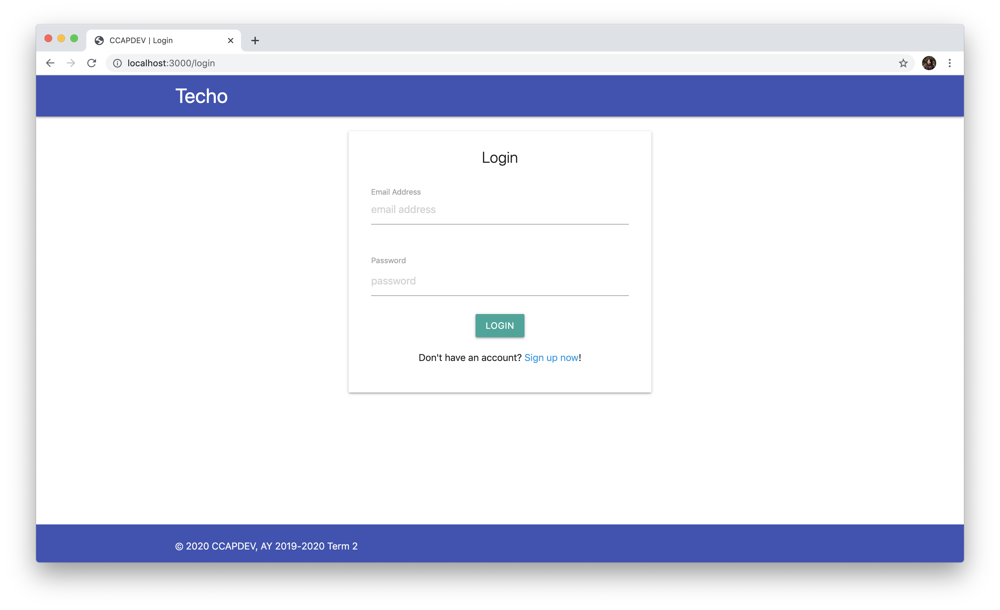

# Application Deployment
This is a simple personal online diary web application with user authentication. It is currently configured to work only in a local development environment. This builds on the previous example of [`node-login-starter`](https://github.com/unisse-courses/node-login-starter).

## Learning Objectives
At the end of this tutorial, you should be able to do the following:
1. Configure the application to use **environment variables** to secure private server configurations.
2. Use [MongoDB Atlas](https://www.mongodb.com/cloud/atlas) instead of a local database server.
3. Deploy the application to [Heroku](https://www.heroku.com/platform).

## Prerequisites
This tutorial assumes you already completed all the prior lessons on databases and sessions.

## Software Dependencies
* [NodeJS & npm](https://www.npmjs.com/get-npm)
* [MongoDB Community Edition](https://docs.mongodb.com/manual/administration/install-community/)
* Any text editor for JavaScript, HTML & CSS (VSCode, Atom, SublimeText, etc.)

## Local Setup
1. Fork this repository to create a copy on your GitHub account.
2. Clone the forked repository to your machine.
  ```shell
  git clone https://github.com/YOUR_USERNAME/node-login-starter.git
  ```
3. Navigate to the directory.
  ```shell
  cd node-deploy-app
  ```
4. Install the dependencies in package.json. All needed packages are already included.
  ```shell
  npm install
  ```
5. Run the server using the script defined (using `nodemon`)
  ```shell
  npm run dev
  ```
6. Navigate to [http://localhost:9090/](http://localhost:9090/). You should see the login page.
  

## Instructions
The application should be completely functional. If you completed the [`node-login-starter`](https://github.com/unisse-courses/node-login-starter) exercise, you should already have a registered user. If not, register and login to view the home page.

Follow the instructions provided in each file below to reconfigure the application to use MongoDB Atlas and environment variables and deply the application.

#### [`01-ATLAS.md`](docs/01-ALTAS.md)
Goes through the steps to create a MongoDB Atlas Cluster and configuring access to the database.

#### [`02-DOTENV.md`](docs/02-DOTENV.md)
Instructions to move high security risk configurations to a `.env` file for development and making the code "production-ready"

#### [`03-HEROKU.md`](docs/03-HEROKU.md)
Instructions to set up Heroku and deploy the application.
